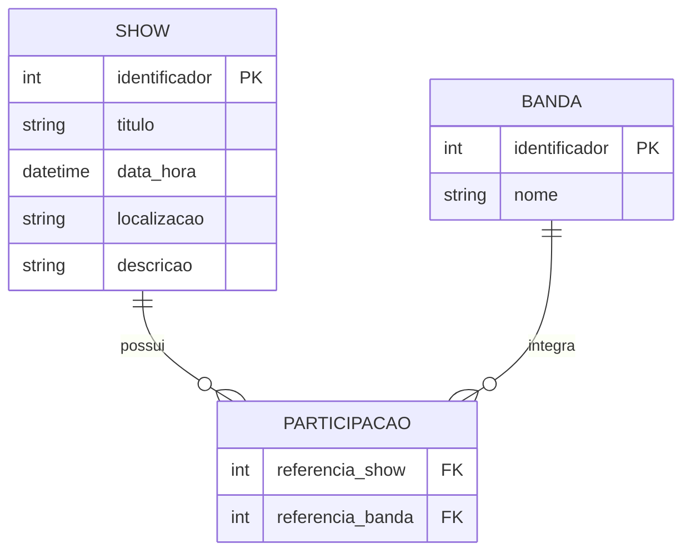
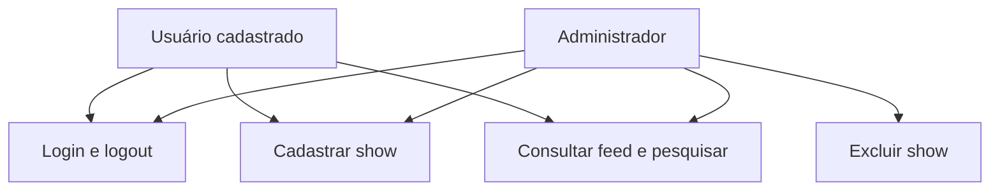
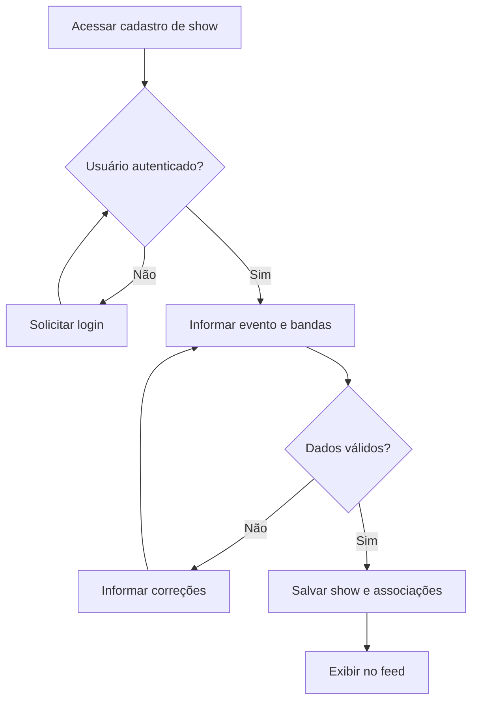

SCENA — Plataforma de Divulgação de Shows
O SCENA é uma aplicação web criada para fortalecer a cena musical, facilitando a divulgação e a descoberta de shows. A proposta é aproximar público, bandas e organizadores em um espaço onde publicar e encontrar eventos seja simples e rápido.
O sistema funciona como uma rede social focada em eventos musicais: os usuários cadastram shows, associam as bandas participantes e consultam as publicações em um feed ou pela pesquisa.
Princípios do Projeto
- Simplicidade: formulários diretos e informações fáceis de entender.
- Foco: divulgação de shows, bandas, locais e datas.
- Velocidade: poucos passos entre cadastrar um evento e divulgá-lo.
Tecnologias Utilizadas
Tecnologia	Utilização
PHP	Processamento das requisições e regras do sistema.
PostgreSQL	Armazenamento dos usuários, shows e bandas.
PDO	Integração entre o PHP e o banco de dados.
HTML	Estrutura das páginas.
CSS	Estilização e organização visual.

Funcionalidades
- Cadastro de usuários.
- Login e logout.
- Cadastro de shows com múltiplas bandas por evento.
- Feed de shows cadastrados.
- Pesquisa de shows.
- Exclusão de shows restrita ao administrador.
Como Executar o Projeto Localmente
Pré-requisitos
- PHP com as extensões PDO e pdo_pgsql habilitadas.
- PostgreSQL instalado e em execução.
- Git, caso o projeto seja obtido por clonagem.
- Navegador web.
Os comandos abaixo usam marcadores para o endereço do repositório, a pasta local e o arquivo SQL. Substitua esses valores pelos nomes utilizados na versão final do projeto.
1. Obter o projeto
git clone <URL_DO_REPOSITORIO>
cd <PASTA_DO_PROJETO>
Também é possível baixar o projeto como ZIP e extrair os arquivos.
2. Criar o banco de dados
Crie um banco no PostgreSQL. Neste exemplo, o nome utilizado é scena:
psql -U postgres -c "CREATE DATABASE scena;"
Importe o script SQL que contém a estrutura final do banco. Para um arquivo SQL em texto:
psql -U postgres -d scena -f <CAMINHO_DO_ARQUIVO_SQL>
Se o banco já estiver criado e configurado, utilize-o sem repetir a criação.
3. Configurar a conexão
No arquivo responsável pela conexão PDO, configure o host, a porta, o nome do banco, o usuário e a senha conforme seu ambiente.
Exemplo de conexão, caso seja necessário adaptar a configuração existente:
<?php

$host = 'localhost';
$port = '5432';
$dbname = 'scena';
$user = 'postgres';
$password = 'sua_senha';

$pdo = new PDO(
    "pgsql:host=$host;port=$port;dbname=$dbname",
    $user,
    $password,
    [PDO::ATTR_ERRMODE => PDO::ERRMODE_EXCEPTION]
);
Mantenha o nome da variável de conexão utilizado pelo restante do projeto.
4. Iniciar a aplicação
Na pasta que contém a página de entrada do projeto, execute:
php -S localhost:8000
Acesse http://localhost:8000 no navegador.
5. Acessar o sistema
Crie uma conta pela página de cadastro e entre com suas credenciais. Para utilizar a exclusão de shows, a conta deve possuir o campo is_admin definido como true no banco de dados.
1. Introdução
1.1 Escopo do Sistema
O SCENA permite cadastrar, listar e pesquisar shows. Cada evento pode reunir múltiplas bandas, mantendo as informações necessárias para que o público encontre apresentações de seu interesse.
A aplicação possui autenticação de usuários e diferencia o acesso comum do administrativo. A exclusão de shows é uma operação exclusiva do administrador.
1.2 Propósito
Facilitar a divulgação de eventos musicais e dar mais visibilidade às bandas e aos espaços que movimentam a cena. O projeto também aplica conceitos de desenvolvimento web, banco de dados relacional e integração com PHP e PDO.
2. Descrição Global
2.1 Público-alvo
- Pessoas que procuram shows.
- Bandas e artistas que desejam divulgar apresentações.
- Organizadores e responsáveis por espaços de música ao vivo.
2.2 Perfis de Acesso
Perfil	Responsabilidade e acesso
Usuário cadastrado	Acessar sua conta e publicar shows, além de consultar os eventos.
Administrador	Utilizar as funções do usuário e excluir shows.

2.3 Principais Telas
Tela	Finalidade
Início / Feed	Exibir os shows publicados.
Pesquisa	Encontrar eventos a partir de um termo de busca.
Login	Autenticar o usuário.
Cadastro de usuário	Criar uma conta.
Cadastro de show	Informar os dados do evento e suas bandas.

3. Requisitos do Sistema
Os requisitos abaixo descrevem o comportamento esperado da aplicação e os critérios técnicos do projeto.
3.1 Requisitos Funcionais
ID	Requisito	Descrição	Prioridade
RF01	Cadastro de usuários	Permitir a criação de contas para acesso ao sistema.	Alta
RF02	Login	Validar as credenciais e iniciar a sessão do usuário.	Alta
RF03	Logout	Encerrar a sessão do usuário.	Alta
RF04	Cadastro de shows	Permitir que usuários autenticados publiquem eventos musicais.	Alta
RF05	Múltiplas bandas	Permitir associar mais de uma banda ao mesmo show.	Alta
RF06	Feed	Listar os shows cadastrados para consulta.	Alta
RF07	Pesquisa	Permitir localizar shows por um termo informado pelo usuário.	Alta
RF08	Identificação do administrador	Diferenciar o acesso administrativo por meio do campo is_admin.	Alta
RF09	Exclusão de shows	Permitir que apenas o administrador exclua shows.	Alta

3.2 Requisitos Não Funcionais
ID	Requisito	Descrição	Prioridade
RNF01	Tecnologias	Utilizar PHP, PostgreSQL, HTML, CSS e PDO.	Alta
RNF02	Usabilidade	Manter formulários simples e uma navegação fácil de compreender.	Alta
RNF03	Legibilidade	Organizar textos e informações para facilitar a leitura.	Alta
RNF04	Consistência visual	Manter o mesmo padrão de navegação e estilo entre as páginas.	Média
RNF05	Controle de acesso	Validar autenticação e permissões no servidor nas operações restritas.	Alta
RNF06	Proteção de senhas	Armazenar senhas como hashes e realizar sua verificação de forma adequada.	Alta
RNF07	Consultas parametrizadas	Utilizar parâmetros nas consultas PDO que recebem dados do usuário.	Alta
RNF08	Integridade dos dados	Preservar os relacionamentos entre shows e bandas ao cadastrar ou excluir eventos.	Alta
RNF09	Compatibilidade	Permitir o uso em navegadores web modernos.	Média

3.3 Regras de Negócio
ID	Regra
RN01	O usuário deve estar autenticado para cadastrar um show.
RN02	Um show pode possuir múltiplas bandas participantes.
RN03	Uma banda pode participar de diferentes shows.
RN04	Apenas usuários com is_admin = true podem excluir shows.
RN05	A permissão de exclusão deve ser validada no servidor, inclusive em acessos diretos à rota.
RN06	O cadastro comum não deve permitir que o próprio usuário conceda privilégios administrativos.
RN07	Um show excluído deve deixar de aparecer no feed e nos resultados de pesquisa.
RN08	Ao excluir um show, seus vínculos com bandas devem ser removidos sem excluir bandas de outros eventos.

4. Organização dos Dados
Esta seção apresenta um modelo conceitual das informações do SCENA. Os nomes exatos das colunas, tipos, restrições e da tabela associativa devem seguir o script SQL da versão final do projeto.
4.1 Dicionário Conceitual de Dados
Entidade	Informação	Finalidade
Usuário	Identificador	Distinguir cada conta.
Usuário	Nome e e-mail	Identificar o usuário e seu acesso.
Usuário	Senha armazenada	Permitir a validação das credenciais.
Usuário	is_admin	Indicar se a conta possui acesso administrativo.
Show	Identificador	Distinguir cada evento.
Show	Título	Apresentar o nome do evento.
Show	Data e horário	Informar quando o evento ocorre.
Show	Localização	Informar onde o evento ocorre.
Show	Descrição	Apresentar informações complementares.
Banda	Identificador	Distinguir cada banda.
Banda	Nome	Identificar a atração musical.
Associação show–banda	Referência ao show	Identificar o evento relacionado.
Associação show–banda	Referência à banda	Identificar a banda participante.

4.2 Relacionamentos
Shows e bandas possuem uma relação de muitos para muitos: um show pode reunir várias bandas, e uma banda pode participar de vários shows. Uma associação entre essas entidades representa cada participação.
5. Diagramas
5.1 Modelo Conceitual de Entidade-Relacionamento
Os nomes abaixo representam entidades lógicas, sem definir os nomes físicos das tabelas.

5.2 Mapa de Funcionalidades por Perfil

5.3 Fluxo de Publicação de um Show

6. Roteiro de Verificação Manual
Cenário	Resultado esperado
Cadastrar usuário e entrar com credenciais válidas	Acesso à conta.
Tentar entrar com credenciais inválidas	Login recusado.
Encerrar a sessão	Operações restritas passam a exigir autenticação.
Cadastrar show com múltiplas bandas	Evento publicado com as bandas associadas.
Pesquisar um termo relacionado a um show	Evento localizado na pesquisa.
Pesquisar um termo sem correspondência	Nenhum resultado exibido.
Tentar excluir show com conta comum, inclusive pela rota direta	Exclusão bloqueada.
Excluir show com conta administrativa	Evento removido do feed e da pesquisa.
Excluir um show cuja banda participa de outro evento	Banda e outro evento preservados.

Este roteiro registra verificações a executar; não representa um relatório de testes realizados.    