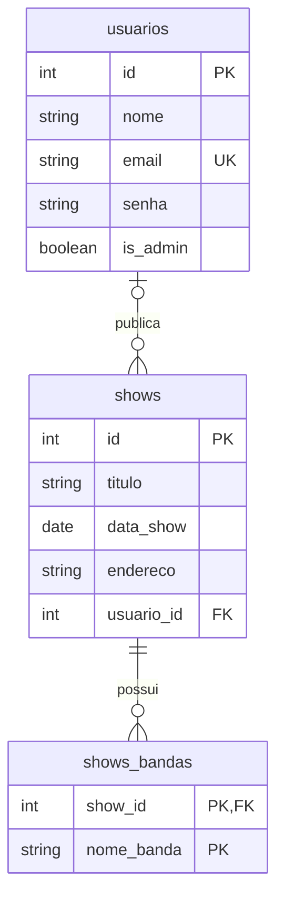
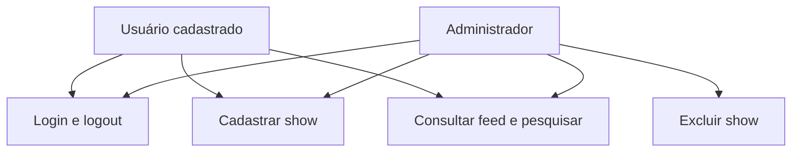
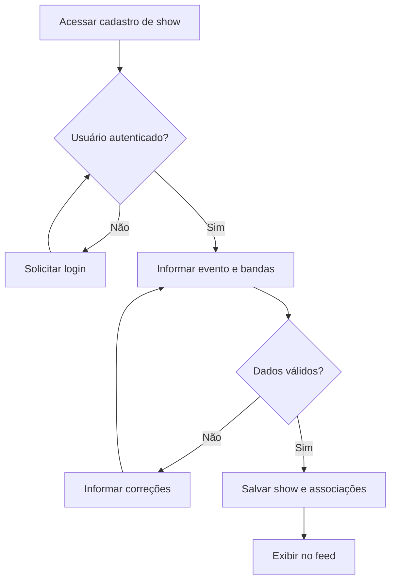

# SCENA — Plataforma de Divulgação de Shows

O **SCENA** é uma aplicação web criada para fortalecer a cena musical, facilitando a divulgação e a descoberta de shows. A proposta é aproximar público, bandas e organizadores em um espaço onde publicar e encontrar eventos seja simples e rápido.

O sistema funciona como uma rede social focada em eventos musicais: os usuários cadastram shows, associam as bandas participantes e consultam as publicações em um feed ou pela pesquisa.

## Princípios do Projeto

O planejamento de entregas está no [Product Backlog](docs/product_backlog.md), com prioridades, histórias de usuário, critérios de aceite e evolução do MVP.

- **Simplicidade:** formulários diretos e informações fáceis de entender.
- **Foco:** divulgação de shows, bandas, locais e datas.
- **Velocidade:** poucos passos entre cadastrar um evento e divulgá-lo.

## Tecnologias Utilizadas

| Tecnologia | Utilização |
| --- | --- |
| PHP | Processamento das requisições e regras do sistema. |
| PostgreSQL | Armazenamento dos usuários, shows e bandas. |
| PDO | Integração entre o PHP e o banco de dados. |
| HTML | Estrutura das páginas. |
| CSS | Estilização e organização visual. |

## Funcionalidades

- Cadastro de usuários.
- Login e logout.
- Cadastro de shows com múltiplas bandas por evento.
- Feed público de shows cadastrados, ordenado pela data do evento.
- Pesquisa de shows por título, disponível para usuários autenticados.
- Exclusão de shows restrita ao administrador.

### Estado atual da implementação

As funcionalidades acima descrevem o escopo do projeto. Os fluxos de cadastro e autenticação ainda possuem erros de execução:

- O cadastro de usuários possui caminhos inválidos nos `require_once` e um redirecionamento incorreto.
- O login inicia a sessão e redireciona depois de gerar HTML; sem buffer de saída, essas operações falham.
- A publicação de shows ainda não utiliza transação, não valida os campos no servidor e não preenche `usuario_id`. Uma falha ao inserir bandas pode deixar o evento parcialmente salvo.
- A exclusão verifica a permissão administrativa no servidor, mas é acionada por GET e ainda não possui proteção contra CSRF.

O feed também inclui eventos passados e, apesar do título da página, não ordena por data de publicação. Essas pendências precisam ser resolvidas para considerar os fluxos completos validados.

---

## Como Executar o Projeto Localmente

### Pré-requisitos

- PHP com as extensões `PDO` e `pdo_pgsql` habilitadas.
- PostgreSQL instalado e em execução.
- Git, caso o projeto seja obtido por clonagem.
- Navegador web.

Os comandos abaixo partem de uma instalação nova e utilizam `scena` como nome da pasta do projeto e do banco. A pasta precisa ter esse nome porque os links e redirecionamentos atuais utilizam o prefixo `/scena/`.

### 1. Obter o projeto

```bash
git clone https://github.com/nicolas-damada/scene-band_hub.git scena
cd scena
```

Também é possível baixar o projeto como ZIP e extrair os arquivos em uma pasta chamada `scena`.

### 2. Criar o banco de dados

Crie um banco no PostgreSQL. Neste exemplo, o nome utilizado é `scena`:

```bash
psql -U postgres -c "CREATE DATABASE scena;"
```

Na pasta do projeto, importe o [script oficial de criação das tabelas](database/tabelas%20atuais.sql) em um banco vazio:

```bash
psql -U postgres -d scena -v ON_ERROR_STOP=1 -f "database/tabelas atuais.sql"
```

Esse script já cria `usuarios.is_admin` como `BOOLEAN NOT NULL DEFAULT FALSE`. Ele não é uma migração para bancos existentes; se o banco já estiver configurado, confira a estrutura antes de executar qualquer script de criação.

Opcionalmente, em um banco de desenvolvimento, carregue os dados de exemplo uma única vez:

```bash
psql -U postgres -d scena -v ON_ERROR_STOP=1 -f database/dados_teste.sql
```

O script cria a conta `teste@scena.com`, com senha `ScenaTeste123!`, sem permissão administrativa, e um show com três bandas. Consulte [database/README.md](database/README.md) para os detalhes dos scripts.

### 3. Configurar a conexão

Em [database/conect.php](database/conect.php), ajuste `$host`, `$dbname`, `$user` e `$pass` conforme seu ambiente. A configuração atual aponta para um servidor da rede local; para um PostgreSQL instalado na mesma máquina, utilize `localhost`. A porta padrão é `5432`; se necessário, inclua outra porta no DSN.

Exemplo de conexão compatível com a variável utilizada pela aplicação e com o retorno esperado por `index.php`:

```php
<?php

$host = 'localhost';
$port = '5432';
$dbname = 'scena';
$user = 'postgres';
$pass = 'sua_senha';

$conexao = new PDO(
    "pgsql:host=$host;port=$port;dbname=$dbname",
    $user,
    $pass,
    [PDO::ATTR_ERRMODE => PDO::ERRMODE_EXCEPTION]
);

return $conexao;
```

Use uma conta do PostgreSQL com acesso às tabelas do banco configurado. As contas cadastradas na tabela `usuarios` são contas da aplicação, distintas do usuário da conexão PDO.

### 4. Iniciar a aplicação

Dentro da pasta `scena`, execute o servidor usando a pasta pai como raiz pública, para preservar o prefixo `/scena/` esperado pelo código:

```bash
php -S localhost:8000 -t ..
```

Acesse [http://localhost:8000/scena/index.php](http://localhost:8000/scena/index.php) no navegador.

### 5. Acessar o sistema

O feed é público. A publicação e a pesquisa exigem login. O fluxo esperado é criar uma conta e entrar com suas credenciais; atualmente, ele depende das correções de cadastro e login descritas em **Estado atual da implementação**. O cadastro não autentica automaticamente o usuário.

Para utilizar a exclusão de shows, a conta deve possuir `is_admin = TRUE`, atribuído pela gestão do sistema no banco de dados. O cadastro comum utiliza o padrão `FALSE` e não oferece essa opção.

---

## 1. Introdução

### 1.1 Escopo do Sistema

O SCENA permite cadastrar, listar e pesquisar shows. Cada evento pode reunir múltiplas bandas, mantendo as informações necessárias para que o público encontre apresentações de seu interesse.

A aplicação possui autenticação de usuários e diferencia o acesso comum do administrativo. A exclusão de shows é uma operação exclusiva do administrador.

### 1.2 Propósito

Facilitar a divulgação de eventos musicais e dar mais visibilidade às bandas e aos espaços que movimentam a cena. O projeto também aplica conceitos de desenvolvimento web, banco de dados relacional e integração com PHP e PDO.

## 2. Descrição Global

### 2.1 Público-alvo

- Pessoas que procuram shows.
- Bandas e artistas que desejam divulgar apresentações.
- Organizadores e responsáveis por espaços de música ao vivo.

### 2.2 Perfis de Acesso

| Perfil | Responsabilidade e acesso |
| --- | --- |
| Visitante | Consultar o feed público e acessar as telas de login e cadastro. |
| Usuário cadastrado | Acessar sua conta e publicar shows, além de consultar os eventos. |
| Administrador | Utilizar as funções do usuário e excluir shows. |

### 2.3 Principais Telas

| Tela | Finalidade |
| --- | --- |
| Início / Feed | Exibir os shows publicados. |
| Pesquisa | Encontrar eventos a partir de um termo de busca. |
| Login | Autenticar o usuário. |
| Cadastro de usuário | Criar uma conta. |
| Cadastro de show | Informar os dados do evento e suas bandas. |
| Quem somos | Apresentar a proposta e o público do SCENA. |

## 3. Requisitos do Sistema

Os requisitos abaixo descrevem o comportamento esperado da aplicação e os critérios técnicos do projeto.

### 3.1 Requisitos Funcionais

| ID | Requisito | Descrição | Prioridade |
| --- | --- | --- | --- |
| RF01 | Cadastro de usuários | Permitir a criação de contas para acesso ao sistema. | Alta |
| RF02 | Login | Validar as credenciais e iniciar a sessão do usuário. | Alta |
| RF03 | Logout | Encerrar a sessão do usuário. | Alta |
| RF04 | Cadastro de shows | Permitir que usuários autenticados publiquem eventos musicais. | Alta |
| RF05 | Múltiplas bandas | Permitir associar mais de uma banda ao mesmo show. | Alta |
| RF06 | Feed | Listar os shows cadastrados para consulta. | Alta |
| RF07 | Pesquisa | Permitir localizar shows por um termo informado pelo usuário. | Alta |
| RF08 | Identificação do administrador | Diferenciar o acesso administrativo por meio do campo `is_admin`. | Alta |
| RF09 | Exclusão de shows | Permitir que apenas o administrador exclua shows. | Alta |

### 3.2 Requisitos Não Funcionais

| ID | Requisito | Descrição | Prioridade |
| --- | --- | --- | --- |
| RNF01 | Tecnologias | Utilizar PHP, PostgreSQL, HTML, CSS e PDO. | Alta |
| RNF02 | Usabilidade | Manter formulários simples e uma navegação fácil de compreender. | Alta |
| RNF03 | Legibilidade | Organizar textos e informações para facilitar a leitura. | Alta |
| RNF04 | Consistência visual | Manter o mesmo padrão de navegação e estilo entre as páginas. | Média |
| RNF05 | Controle de acesso | Validar autenticação e permissões no servidor nas operações restritas. | Alta |
| RNF06 | Proteção de senhas | Armazenar senhas como hashes e realizar sua verificação de forma adequada. | Alta |
| RNF07 | Consultas parametrizadas | Utilizar parâmetros nas consultas PDO que recebem dados do usuário. | Alta |
| RNF08 | Integridade dos dados | Preservar os relacionamentos entre shows e bandas ao cadastrar ou excluir eventos. | Alta |
| RNF09 | Compatibilidade | Permitir o uso em navegadores web modernos. | Média |

### 3.3 Regras de Negócio

| ID | Regra |
| --- | --- |
| RN01 | O usuário deve estar autenticado para cadastrar um show. |
| RN02 | Um show pode possuir múltiplas bandas participantes. |
| RN03 | Uma banda pode participar de diferentes shows. |
| RN04 | Apenas usuários com `is_admin = true` podem excluir shows. |
| RN05 | A permissão de exclusão deve ser validada no servidor, inclusive em acessos diretos à rota. |
| RN06 | O cadastro comum não deve permitir que o próprio usuário conceda privilégios administrativos. |
| RN07 | Um show excluído deve deixar de aparecer no feed e nos resultados de pesquisa. |
| RN08 | Ao excluir um show, seus vínculos com bandas devem ser removidos sem excluir bandas de outros eventos. |

## 4. Organização dos Dados

Esta seção descreve o modelo atual definido em [database/tabelas atuais.sql](database/tabelas%20atuais.sql). Os nomes das bandas são armazenados diretamente em `shows_bandas`; não existe uma tabela independente `bandas`.

### 4.1 Dicionário de Dados

| Tabela | Campo | Tipo e restrições | Finalidade |
| --- | --- | --- | --- |
| `usuarios` | `id` | `SERIAL`, chave primária | Identificar a conta. |
| `usuarios` | `nome` | `VARCHAR(50) NOT NULL` | Nome do usuário. |
| `usuarios` | `email` | `VARCHAR(255) NOT NULL UNIQUE` | E-mail de acesso. |
| `usuarios` | `senha` | `VARCHAR(255) NOT NULL` | Hash da senha. |
| `usuarios` | `is_admin` | `BOOLEAN NOT NULL DEFAULT FALSE` | Indicar a permissão administrativa. |
| `shows` | `id` | `SERIAL`, chave primária | Identificar o evento. |
| `shows` | `titulo` | `VARCHAR(255) NOT NULL` | Nome do evento. |
| `shows` | `data_show` | `DATE NOT NULL` | Data do evento, sem horário. |
| `shows` | `endereco` | `VARCHAR(255) NOT NULL` | Local ou endereço do evento. |
| `shows` | `usuario_id` | `INT`, chave estrangeira, aceita nulo | Referência ao autor; ainda não preenchida pela publicação. |
| `shows_bandas` | `show_id` | `INT NOT NULL`, chave estrangeira | Referência ao show. |
| `shows_bandas` | `nome_banda` | `VARCHAR(255) NOT NULL` | Nome de uma banda participante. |

A chave primária de `shows_bandas` é composta por `show_id` e `nome_banda`. Horário, descrição, cidade e gênero não possuem campos específicos no modelo atual; sua inclusão seria uma evolução futura.

### 4.2 Relacionamentos

- Um usuário pode estar associado a vários shows; cada show pode ter um usuário responsável. A exclusão do usuário define `usuario_id` como nulo (`ON DELETE SET NULL`).
- Um show possui vários registros em `shows_bandas`. A exclusão do show remove suas participações (`ON DELETE CASCADE`).
- O mesmo nome de banda pode aparecer em diferentes shows, mas não há um identificador compartilhado nem um cadastro independente de bandas. A chave composta impede repetir exatamente o mesmo nome no mesmo show.

## 5. Diagramas

### 5.1 Modelo Atual de Entidade-Relacionamento

O diagrama representa as tabelas atuais. Em `shows_bandas`, os dois campos formam a chave primária composta.



### 5.2 Mapa de Funcionalidades por Perfil



### 5.3 Fluxo de Publicação de um Show

Este é o fluxo esperado. A validação no servidor e a gravação de show e bandas em uma única transação ainda estão pendentes na implementação.



## 6. Roteiro de Verificação Manual

| Cenário | Resultado esperado |
| --- | --- |
| Cadastrar usuário e entrar com credenciais válidas | Acesso à conta. |
| Tentar entrar com credenciais inválidas | Login recusado. |
| Encerrar a sessão | Operações restritas passam a exigir autenticação. |
| Cadastrar show com múltiplas bandas | Evento publicado com as bandas associadas. |
| Pesquisar um termo relacionado a um show | Evento localizado na pesquisa. |
| Pesquisar um termo sem correspondência | Nenhum resultado exibido. |
| Tentar excluir show com conta comum, inclusive pela rota direta | Exclusão bloqueada. |
| Excluir show com conta administrativa | Evento removido do feed e da pesquisa. |
| Excluir um show cuja banda participa de outro evento | Banda e outro evento preservados. |

Este roteiro registra verificações a executar; não representa um relatório de testes realizados.
